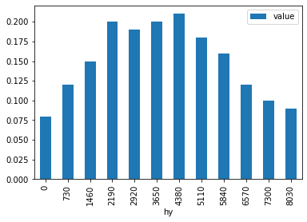
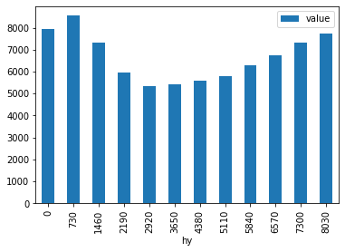

.. code:: ipython3

    import sys
    sys.path.append('/mnt/data/Dropbox/GRIMSEL_SOURCE/grimsel')
    

.. |CO2| replace:: CO\ :sub:`2`\ \

======================
Introductory example-
======================

This example provides a minimal example of the modeling process with Grimsel, including the definition of the input tables.

.. code:: ipython3

    from grimsel.core.io import IO
    import numpy as np
    import pandas as pd
    import grimsel.core.model_loop as model_loop
    from grimsel.core.model_base import ModelBase as MB
    from grimsel import logger
    logger.setLevel(0)

Definition of the input data
=============================

First, all required input tables are explained and defined as :class:`pandas.Dataframes`. They are later written to csv files in order to be read by Grimsel. Input data in Grimsel is structured like a normalized database (see :ref:`Input data structure <input_data_structure>`). It is recommended to write input data to an appropriately constrained SQL schema to ensure consistency.

The ``def_node`` table
-------------------------

The ``def_node`` table contains the mapping between *nd_id*s and node names *nd* as well as all parameters which are indexed by the nodes only. In this simple example we define a single node ``Node1`` with a certain |CO2| price ``price_co2`` (EUR/t). The node weight is used to scale nodes, e.g. to represent :math:`n` households through a single household node. It serves as a factor in the objective function :func:`grimsel.core.constraints.add_objective_rules` (all costs are scaled by *node_weight*), the supply constraint :func:`grimsel.core.constraints.add_supply_rules` (power exchange between nodes is scaled accordingly), and the cross-border transmission capacity (:func:`grimsel.core.constraints.add_transmission_bounds_rules`).

Note that Grimsel is agnostic with respect to physical units. The price on |CO2| could be defined in different units as long as consistency with the other parameters (emission intensity etc.) is ensured.

Columns which don't correspond to Grimsel parameter names are ignored. While this can cause mistakes, it is convenient to keep additional columns in the same tables for mmodifications of the model parameters (e.g. for future years, columns *_yr2020* etc. in the *plant_encar* table, see :ref:`Input data structure <input_data_structure>`)

.. code:: ipython3

    df_def_node = pd.DataFrame({'nd': ['Node1'], 
                                'nd_id':[0], 
                                'price_co2': [10],
                                'nd_weight': [1]})
    dict_nd = df_def_node.set_index('nd').nd_id.to_dict()
    display(df_def_node)

.. raw:: html

    

    
    <table border="1" class="dataframe">
      <thead>
        <tr style="text-align: right;">
          <th></th>
          <th>nd</th>
          <th>nd_id</th>
          <th>price_co2</th>
          <th>nd_weight</th>
        </tr>
      </thead>
      <tbody>
        <tr>
          <th>0</th>
          <td>Node1</td>
          <td>0</td>
          <td>10</td>
          <td>1</td>
        </tr>
      </tbody>
    </table>
    

.. important::
   The indices *nd_id* are best generated after the finalization of the table. The same holds for all other basic indices (power plants *pp_id*, fuels *fl_id* etc). It is good practice to never assume numerical indices as fixed, but to use translated names instead. The :class:`grimsel.core.auxiliary.maps.Maps` class provides convenience methods and attributes for this. For example, instead of referring to ``nd_id = 0`` we would always use ``nd_id = mps.dict_nd['Node1']`` instead (with ``mps`` an instance of the ``Maps`` class). Since the *def_node* table defines the node ids, the mapping between node names and ids is stored in the dictionary ``dict_nd`` for translation of the node names in the other tables (see below). 

The ``def_fuel`` table
--------------------------

Every power plant in the broadest sense has a fuel. This includes fuel-less renewable generators (wind, solar), demand-like model components, and transmission between nodes. In this simple example we consider 3 concrete fuel types. The |CO2| emission intensity parameter *co2_int* defines the specific emissions per unit of fuel energy content :math:`\mathrm{t_{CO_2}/MWh_{fl}}`.

.. note::
   Abstract fuels which follow directly from the model structure (demand, curtailment, transmission) don't have to be defined in the input table (though they can). They are automatically appended by the :module:`grimsel.core.autocomplete` module.

.. code:: ipython3

    df_def_fuel = pd.DataFrame({'fl_id': range(3),
                                'fl': ['natural_gas', 'hard_coal', 'solar'], 
                                'co2_int': [0.20, 0.35, 0]})
    dict_fl = df_def_fuel.set_index('fl').fl_id.to_dict()
    display(df_def_fuel)

.. raw:: html

    

    
    <table border="1" class="dataframe">
      <thead>
        <tr style="text-align: right;">
          <th></th>
          <th>fl_id</th>
          <th>fl</th>
          <th>co2_int</th>
        </tr>
      </thead>
      <tbody>
        <tr>
          <th>0</th>
          <td>0</td>
          <td>natural_gas</td>
          <td>0.20</td>
        </tr>
        <tr>
          <th>1</th>
          <td>1</td>
          <td>hard_coal</td>
          <td>0.35</td>
        </tr>
        <tr>
          <th>2</th>
          <td>2</td>
          <td>solar</td>
          <td>0.00</td>
        </tr>
      </tbody>
    </table>
    

The ``def_encar`` table
--------------------------

Definition of produced energy carriers.

.. note::
   In systems where a produced energy carrier can be consumed by other plants (e.g. electricity to produce heat), a column *fl_id* is required, which maps the output (e.g. electricity) carrier to the input (e.g. electricity) fuel.

.. code:: ipython3

    df_def_encar = pd.DataFrame({'ca_id': [0],
                                 'ca': ['EL']})
    dict_ca = df_def_encar.set_index('ca').ca_id.to_dict()
    display(df_def_encar)

.. raw:: html

    

    
    <table border="1" class="dataframe">
      <thead>
        <tr style="text-align: right;">
          <th></th>
          <th>ca_id</th>
          <th>ca</th>
        </tr>
      </thead>
      <tbody>
        <tr>
          <th>0</th>
          <td>0</td>
          <td>EL</td>
        </tr>
      </tbody>
    </table>
    

The ``def_pp_type`` table
---------------------------
This table defines the power plant type, which---similar to the fuel---groups power plants according to certain characteristics. Its purpose is filtering of model input and power plant aggregation for analysis. No parameters, variables, or constraints are associated with the power plant type.

.. code:: ipython3

    df_def_pp_type = pd.DataFrame({'pt_id': range(3), 'pt': ['GAS_LIN', 'SOLAR', 'HCO_ELC']})
    dict_pt = df_def_pp_type.set_index('pt').pt_id.to_dict()
    display(df_def_pp_type)

.. raw:: html

    

    
    <table border="1" class="dataframe">
      <thead>
        <tr style="text-align: right;">
          <th></th>
          <th>pt_id</th>
          <th>pt</th>
        </tr>
      </thead>
      <tbody>
        <tr>
          <th>0</th>
          <td>0</td>
          <td>GAS_LIN</td>
        </tr>
        <tr>
          <th>1</th>
          <td>1</td>
          <td>SOLAR</td>
        </tr>
        <tr>
          <th>2</th>
          <td>2</td>
          <td>HCO_ELC</td>
        </tr>
      </tbody>
    </table>
    

The ``def_plant`` table
--------------------------

The def plant table defines the power plants. It establishes the link between the fuel ids, the power plant type ids, and the node ids with power plants. Furthermore, it assigns power plants to certain :ref:`power plant subsets <power_plant_sets>`. In the example below, we define the subsets of 

* fixed profile plants (wind, *set_def_pr*)
* dispatchable power plants (both gas plants and coal, *set_def_pp*)
* power plants with linear cost supply curve (*ND1_GAS_LIN*, *set_def_lin*); these plants require the definition of the supply curve coefficients (see the :ref:corresponding input table`<introductory_example_plant_encar>`).
* power plants whose capacity can be expanded/invested in (new gas and wind, *set_def_add*)

.. code:: ipython3

    df_def_plant = pd.DataFrame({'pp': ['ND1_GAS_LIN', 'ND1_GAS_NEW', 'ND1_SOLAR', 'ND1_HCO_ELC'],
                                 'pp_id': range(4),
                                 'pt_id': ['GAS_LIN', 'GAS_LIN', 'SOLAR', 'HCO_ELC'],
                                 'nd_id': ['Node1'] * 4,
                                 'fl_id': ['natural_gas', 'natural_gas', 'solar', 'hard_coal'],
                                 'set_def_pr': [0, 0, 1, 0],
                                 'set_def_pp': [1, 1, 0, 1],
                                 'set_def_lin': [1, 0, 0, 0],
                                 'set_def_add': [0, 1, 1, 0],
                                })
    # translate columns to id using the previously defined def tables
    df_def_plant = df_def_plant.assign(pt_id=df_def_plant.pt_id.replace(dict_pt),
                                       nd_id=df_def_plant.nd_id.replace(dict_nd),
                                       fl_id=df_def_plant.fl_id.replace(dict_fl))
    dict_pp = df_def_plant.set_index('pp').pp_id.to_dict()
    
    display(df_def_plant)

.. raw:: html

    

    
    <table border="1" class="dataframe">
      <thead>
        <tr style="text-align: right;">
          <th></th>
          <th>pp</th>
          <th>pp_id</th>
          <th>pt_id</th>
          <th>nd_id</th>
          <th>fl_id</th>
          <th>set_def_pr</th>
          <th>set_def_pp</th>
          <th>set_def_lin</th>
          <th>set_def_add</th>
        </tr>
      </thead>
      <tbody>
        <tr>
          <th>0</th>
          <td>ND1_GAS_LIN</td>
          <td>0</td>
          <td>0</td>
          <td>0</td>
          <td>0</td>
          <td>0</td>
          <td>1</td>
          <td>1</td>
          <td>0</td>
        </tr>
        <tr>
          <th>1</th>
          <td>ND1_GAS_NEW</td>
          <td>1</td>
          <td>0</td>
          <td>0</td>
          <td>0</td>
          <td>0</td>
          <td>1</td>
          <td>0</td>
          <td>1</td>
        </tr>
        <tr>
          <th>2</th>
          <td>ND1_SOLAR</td>
          <td>2</td>
          <td>1</td>
          <td>0</td>
          <td>2</td>
          <td>1</td>
          <td>0</td>
          <td>0</td>
          <td>1</td>
        </tr>
        <tr>
          <th>3</th>
          <td>ND1_HCO_ELC</td>
          <td>3</td>
          <td>2</td>
          <td>0</td>
          <td>1</td>
          <td>0</td>
          <td>1</td>
          <td>0</td>
          <td>0</td>
        </tr>
      </tbody>
    </table>
    

.. _introductory_example_def_profile::

The ``def_profile`` table
--------------------------

This table assigns an id to the model's temporal profiles, i.e. parameters which are defined for each time slot. In the example below this includes 

* the demand (units :math:`\mathrm{MW}`)
* the wind supply profiles (capacity factors per time slot, unitless). 

Other profiles not included in this example

* price profiles (e.g. to model households or micro-grids buying eletricity with time-dependencies of electricity tariffs)
* CHP profiles which define a lower bound of power production for certain power plants

.. code:: ipython3

    df_def_profile = pd.DataFrame({'pf_id': range(2),
                                   'pf': ['SUPPLY_SOLAR', 'DMND_NODE1']})
    dict_pf = df_def_profile.set_index('pf').pf_id.to_dict()
    display(df_def_profile)

.. raw:: html

    

    
    <table border="1" class="dataframe">
      <thead>
        <tr style="text-align: right;">
          <th></th>
          <th>pf_id</th>
          <th>pf</th>
        </tr>
      </thead>
      <tbody>
        <tr>
          <th>0</th>
          <td>0</td>
          <td>SUPPLY_SOLAR</td>
        </tr>
        <tr>
          <th>1</th>
          <td>1</td>
          <td>DMND_NODE1</td>
        </tr>
      </tbody>
    </table>
    

.. _introductory_example_plant_encar:

The ``plant_encar`` table
--------------------------

This table contains the main collection of power plant parameters. It is indexed by the power plant id and the energy carrier id. For example, a CHP plant might have different efficiencies for the production of heat and electricity. In the example below, only electricity is considered as an energy carrier.

The parameters included in the table below are defined in the :class:`grimsel.core.parameters.Parameters` documentation. Note that as of now Grimsel requires fixed cost annuities (e.g. :math:`EUR/MW/yr`). In the example below they arae calculated a-priori.

.. code:: ipython3

    eff_gas_min = 0.4
    eff_gas_max = 0.6
    cap_gas = 4000.
    f0_gas = 1/eff_gas_min
    f1_gas = 1/cap_gas * (f0_gas - 1/eff_gas_max)
    
    
    dr, lt = 0.06, 20 # assumed discount rate 6% and life time
    fact_ann = ((1+dr)**lt * dr) / ((1+dr)**lt - 1)
    
    fc_cp_gas = 800000  # assumed capital cost nenw gas plants (EUR/MW)
    fc_cp_gas_ann = fact_ann * fc_cp_gas
    
    fc_cp_solar = 1500000  # assumed capital cost solar power (EUR/MW)
    fc_cp_solar_ann = fact_ann * fc_cp_solar
    
    df_plant_encar = pd.DataFrame({'pp_id': ['ND1_GAS_LIN', 'ND1_GAS_NEW', 'ND1_SOLAR', 'ND1_HCO_ELC'],
                                   'ca_id': ['EL'] * 4,
                                   'supply_pf_id': [None, None, 'SUPPLY_SOLAR', None],
                                   'pp_eff': [None, eff_gas_max, None, 0.4],
                                   'factor_lin_0': [f0_gas, None, None, None],
                                   'factor_lin_1': [f1_gas, None, None, None],
                                   'cap_pwr_leg': [0, 0, 0, 5000],
                                   'fc_cp_ann': [None, fc_cp_gas_ann, fc_cp_solar_ann, None],
                                  })
    
    df_plant_encar = df_plant_encar.assign(supply_pf_id=df_plant_encar.supply_pf_id.replace(dict_pf),
                                           pp_id=df_plant_encar.pp_id.replace(dict_pp),
                                           ca_id=df_plant_encar.ca_id.replace(dict_ca))
    display(df_plant_encar)

.. raw:: html

    

    
    <table border="1" class="dataframe">
      <thead>
        <tr style="text-align: right;">
          <th></th>
          <th>pp_id</th>
          <th>ca_id</th>
          <th>supply_pf_id</th>
          <th>pp_eff</th>
          <th>factor_lin_0</th>
          <th>factor_lin_1</th>
          <th>cap_pwr_leg</th>
          <th>fc_cp_ann</th>
        </tr>
      </thead>
      <tbody>
        <tr>
          <th>0</th>
          <td>0</td>
          <td>0</td>
          <td>None</td>
          <td>NaN</td>
          <td>2.5</td>
          <td>0.000208</td>
          <td>0</td>
          <td>NaN</td>
        </tr>
        <tr>
          <th>1</th>
          <td>1</td>
          <td>0</td>
          <td>None</td>
          <td>0.6</td>
          <td>NaN</td>
          <td>NaN</td>
          <td>0</td>
          <td>69747.645581</td>
        </tr>
        <tr>
          <th>2</th>
          <td>2</td>
          <td>0</td>
          <td>0</td>
          <td>NaN</td>
          <td>NaN</td>
          <td>NaN</td>
          <td>0</td>
          <td>130776.835465</td>
        </tr>
        <tr>
          <th>3</th>
          <td>3</td>
          <td>0</td>
          <td>None</td>
          <td>0.4</td>
          <td>NaN</td>
          <td>NaN</td>
          <td>5000</td>
          <td>NaN</td>
        </tr>
      </tbody>
    </table>
    

.. code:: ipython3

    fc_cp_solar_ann

.. parsed-literal::

    130776.83546527711

The ``node_encar`` table
------------------------

This table maps the demand profile for a certain energy carrier in a certain node to the corresponding profile id. In addition, grid losses depend on the node and the energy carrier. They would be defined in this table. Since they default to zero (see :class:`grimsel.core.parameters.Parameters`), they are omitted.

.. note::
   While this column is not used in the model, the total demand per node and energy carrier (*dmnd_sum*) could be added to this table, to scale demand profiles according to the total demand during future years.

.. code:: ipython3

    df_node_encar = pd.DataFrame({'nd_id': ['Node1'], 'ca_id': ['EL'],
                                  'dmnd_pf_id': ['DMND_NODE1']
                                  })
    df_node_encar = df_node_encar.assign(nd_id=df_node_encar.nd_id.replace(dict_nd),
                                         ca_id=df_node_encar.ca_id.replace(dict_ca),
                                         dmnd_pf_id=df_node_encar.dmnd_pf_id.replace(dict_pf))
    df_node_encar

.. raw:: html

    

    
    <table border="1" class="dataframe">
      <thead>
        <tr style="text-align: right;">
          <th></th>
          <th>nd_id</th>
          <th>ca_id</th>
          <th>dmnd_pf_id</th>
        </tr>
      </thead>
      <tbody>
        <tr>
          <th>0</th>
          <td>0</td>
          <td>0</td>
          <td>1</td>
        </tr>
      </tbody>
    </table>
    

The ``fuel_node_encar`` table
--------------------------------

The fuel cost is defined per fuel, node, and produced energy carrier. The indexing of this parameter by produced energy carrier is not necessarily meaningful, but no separate ``fuel_node`` table exists as of now.

Other parameters defined in this table are listed in the parameter docs.

.. code:: ipython3

    df_fuel_node_encar = pd.DataFrame({'fl_id': ['natural_gas', 'hard_coal'],
                                       'nd_id': ['Node1'] * 2,
                                       'ca_id': ['EL'] * 2,
                                       'vc_fl': [40, 10],
                                      })
    df_fuel_node_encar = df_fuel_node_encar.assign(fl_id=df_fuel_node_encar.fl_id.replace(dict_fl),
                                           nd_id=df_fuel_node_encar.nd_id.replace(dict_nd),
                                           ca_id=df_fuel_node_encar.ca_id.replace(dict_ca))
    df_fuel_node_encar

.. raw:: html

    

    
    <table border="1" class="dataframe">
      <thead>
        <tr style="text-align: right;">
          <th></th>
          <th>fl_id</th>
          <th>nd_id</th>
          <th>ca_id</th>
          <th>vc_fl</th>
        </tr>
      </thead>
      <tbody>
        <tr>
          <th>0</th>
          <td>0</td>
          <td>0</td>
          <td>0</td>
          <td>40</td>
        </tr>
        <tr>
          <th>1</th>
          <td>1</td>
          <td>0</td>
          <td>0</td>
          <td>10</td>
        </tr>
      </tbody>
    </table>
    

The ``profsupply`` table
--------------------------

This table contains the supply profiles (see table :ref:`def_profile <introductory_example_def_profile>`) for each supply profile id and "each hour of the year" ``hy``. The hour of the year corresponds to the raw time resolution, which is defined and potentially reduced during the model call.

Note that no capacity constraints apply to plants with fixed profiles. Consequently, Grimsel would accept capacity factors > 1.

The 

As always, units are implicitly defined by the input data. Another approach would be the definition of the profile in terms of :math:`\mathrm{MW}` while keeping the capacities of the corresponding plants equal to 1.

.. code:: ipython3

    prf = [0.08, 0.12, 0.15, 0.20, 0.19, 0.20, 
           0.21, 0.18, 0.16, 0.12, 0.10, 0.09]
    df_profsupply = pd.DataFrame({'supply_pf_id': [dict_pf['SUPPLY_SOLAR']] * len(prf),
                                  'hy': range(0, 8760, 730), 'value': prf})
    
    _ = df_profsupply.set_index('hy')[['value']].plot.bar()

The ``profdmnd`` table
--------------------------

Defines the demand profile (units :math:`\mathrm{MW}`)

.. code:: ipython3

    prf = [7951.7, 8543.8, 7302.0, 5938.3, 5323.8, 5411.6, 
           5582.0, 5776.5, 6304.9, 6736.7, 7327.8, 7720.7]
    
    df_profdmnd = pd.DataFrame({'dmnd_pf_id': [dict_pf['DMND_NODE1']] * len(prf),
                                'hy':  range(0, 8760, 730), 'value': prf})
    
    _ = df_profdmnd.set_index('hy')[['value']].plot.bar()

Writing input tables to disk
---------------------------------

All tables are saved as csv files. This is currently the input data format of choice. PostgreSQL input support needs to be fixed. 

.. code:: ipython3

    import os
    try: os.mkdir('introductory_example_files')
    except: pass
    for dftb, tbname in [(df_def_node, 'def_node'),
                       (df_def_plant, 'def_plant'),
                       (df_def_fuel, 'def_fuel'),
                       (df_def_encar, 'def_encar'),
                       (df_node_encar, 'node_encar'),
                       (df_def_pp_type, 'def_pp_type'),
                       (df_plant_encar, 'plant_encar'),
                       (df_def_profile, 'def_profile'),
                       (df_fuel_node_encar, 'fuel_node_encar'),
                       (df_profsupply, 'profsupply'),
                       (df_profdmnd, 'profdmnd')]:
        dftb.to_csv('introductory_example_files/{}.csv'.format(tbname), index=False)

.. code:: ipython3

    from grimsel.core.model_base import ModelBase
    mkwargs = {}
    
    ModelBase(**mkwargs)

.. parsed-literal::

    <grimsel.core.model_base.ModelBase at 0x7f6c6df4b798>

Setting up the model instance
=============================

The model instance (class :class:`grimsel.core.model_base.ModelBase`) is intialized through the :class:`grimsel.core.model_loop.ModelLoop` class. The ModelLoop manages model variations and initializes the IO class, which reads and writes the model input and output data. Note that because of this setup, the ModelBase class cannot be initialized on its own in a meaningful way, since it lacks the features of reading and writing data. 

The model parameter is only the time slot structure: Here we specify that the input data has 730 (1 month) time resolution, and that we want to construct the model with the same number of time slots: ``(730, 730)``. Alternatively, we could lower the time resolution to any multiple of the original time resolution, e.g. ``(730, 730*2)``.

The IO class is initialized using the following parameters:

* ``data_path``: location of the input (csv) files
* ``output_target``: one of (``fastparquet``, ``psql``, ``hdf5``); current, ``fastparquet`` is the format of choice, the others require fixing
* ``cl_out``: output collection; here: path for parquet files; parquet files are written separately by variable and model run; alternatively PostgreSQL schema (if ``output_target == psql``) or HDF5 file name
* ``dev_mode: True`` skips confirmation prompt prior to overwriting existing output files

.. code:: ipython3

    mkwargs = {'nhours': (730, 730)}
    iokwargs = {'data_path': os.path.abspath('introductory_example_files/'),
                'output_target': 'fastparquet',
                'autocomplete_curtailment': True,
                'cl_out': 'introductory_example_files/output',  # output collection (here: path for parquet files)
                'dev_mode': True, # skips confirmation prompt prior to overwriting existing output files
               }

The ``nsteps`` list is the main parameter defining the model variations. In this example, we want to vary the |CO2| price for 5 values of equal spacing (``swco``). In adddition, the installation of new gas power plants is allowed or not (2 discrete value ``swnewgas``). The prefix ``sw`` ("sweep") is a convention and not strictly necessary.

.. code:: ipython3

    nsteps = [('swco', 5, np.linspace),  # CO2 emission price
              ('swnewgas', 2, np.arange),  # allow installation of new gas plants yes/no
             ]

For convenience, we can define appropriate dictionaries with clearer names for the envisioned model modifications:

.. code:: ipython3

    dict_swnewgas = {0: 'default', 1: 'exclude_gas'}

The |CO2| price will be scaled between 0 and a maximum. Therefore, no such names definitions are necessary.

Initializing the ``ModelLoop`` class results in the following:

* Initialization of a ``ModelBase`` instance, which subclasses the Pyomo Model class, holds all model components, and performs single model runs
* Initialization of a :class:`grimsel.core.io.IO` instance, which takes care of input data reading and output data writing
* The creation of the ``ModelLoop.def_run`` table (see below)
* call the :py:meth:`grimsel.core.io.IO.read_model_data` method 
* call the :py:meth:`grimsel.core.model_base.ModelBase.init_maps` method which creates a :class:`grimsel.core.auxiliary.maps.Maps` instance (see below)
* call the :py:meth:`grimsel.core.model_base.ModelBase.map_to_time_res` method which handles all functionalities related to time mapping and 
* call the :py:meth:`grimsel.core.io.IO.write_runtime_tables` method, which writes model tables which where generated during model creation
* call the :py:meth:`grimsel.core.model_base.ModelBase.get_setlst` method
* call the :py:meth:`grimsel.core.model_base.ModelBase.define_sets` method
* call the :py:meth:`grimsel.core.model_base.ModelBase.add_parameters` method
* call the :py:meth:`grimsel.core.model_base.ModelBase.define_variables` method
* call the :py:meth:`grimsel.core.model_base.ModelBase.add_all_constraints` method
* call the :py:meth:`grimsel.core.model_base.ModelBase.init_solver` method
* call the :py:meth:`grimsel.core.io.IO.init_output_tables` method

.. code:: ipython3

    logger.setLevel('ERROR')
    ml = model_loop.ModelLoop(nsteps=nsteps, mkwargs=mkwargs, iokwargs=iokwargs)

The `ml.df_def_run` table
-------------------------

The model runs to be performed are summarized in the `ml.df_def_run` table. By default it contains all combinations of model parameter variations defined in the `nhours` parameter:

.. code:: ipython3

    ml.df_def_run

.. raw:: html

    

    
    <table border="1" class="dataframe">
      <thead>
        <tr style="text-align: right;">
          <th></th>
          <th>run_id</th>
          <th>swco_id</th>
          <th>swnewgas_id</th>
          <th>swco</th>
          <th>swnewgas</th>
          <th>swco_vl</th>
          <th>swnewgas_vl</th>
        </tr>
      </thead>
      <tbody>
        <tr>
          <th>0</th>
          <td>0</td>
          <td>0.0</td>
          <td>0.0</td>
          <td>0.00</td>
          <td>0.0</td>
          <td>NaN</td>
          <td>NaN</td>
        </tr>
        <tr>
          <th>1</th>
          <td>1</td>
          <td>1.0</td>
          <td>0.0</td>
          <td>0.25</td>
          <td>0.0</td>
          <td>NaN</td>
          <td>NaN</td>
        </tr>
        <tr>
          <th>2</th>
          <td>2</td>
          <td>2.0</td>
          <td>0.0</td>
          <td>0.50</td>
          <td>0.0</td>
          <td>NaN</td>
          <td>NaN</td>
        </tr>
        <tr>
          <th>3</th>
          <td>3</td>
          <td>3.0</td>
          <td>0.0</td>
          <td>0.75</td>
          <td>0.0</td>
          <td>NaN</td>
          <td>NaN</td>
        </tr>
        <tr>
          <th>4</th>
          <td>4</td>
          <td>4.0</td>
          <td>0.0</td>
          <td>1.00</td>
          <td>0.0</td>
          <td>NaN</td>
          <td>NaN</td>
        </tr>
        <tr>
          <th>5</th>
          <td>5</td>
          <td>0.0</td>
          <td>1.0</td>
          <td>0.00</td>
          <td>1.0</td>
          <td>NaN</td>
          <td>NaN</td>
        </tr>
        <tr>
          <th>6</th>
          <td>6</td>
          <td>1.0</td>
          <td>1.0</td>
          <td>0.25</td>
          <td>1.0</td>
          <td>NaN</td>
          <td>NaN</td>
        </tr>
        <tr>
          <th>7</th>
          <td>7</td>
          <td>2.0</td>
          <td>1.0</td>
          <td>0.50</td>
          <td>1.0</td>
          <td>NaN</td>
          <td>NaN</td>
        </tr>
        <tr>
          <th>8</th>
          <td>8</td>
          <td>3.0</td>
          <td>1.0</td>
          <td>0.75</td>
          <td>1.0</td>
          <td>NaN</td>
          <td>NaN</td>
        </tr>
        <tr>
          <th>9</th>
          <td>9</td>
          <td>4.0</td>
          <td>1.0</td>
          <td>1.00</td>
          <td>1.0</td>
          <td>NaN</td>
          <td>NaN</td>
        </tr>
      </tbody>
    </table>
    

This table can be filtered to reduce the number of model. For example, if we are primarily interested in the default case including new gas power plants, we could selectively reduce the resolution of the |CO2| price variation:

.. code:: ipython3

    mask_remove = ((ml.df_def_run.swnewgas_id == {v: k for k, v in dict_swnewgas.items()}['exclude_gas'])
                   & (ml.df_def_run.swco_id % 2 != 0))
    ml.df_def_run = ml.df_def_run.loc[~mask_remove]
    ml.df_def_run

.. raw:: html

    

    
    <table border="1" class="dataframe">
      <thead>
        <tr style="text-align: right;">
          <th></th>
          <th>run_id</th>
          <th>swco_id</th>
          <th>swnewgas_id</th>
          <th>swco</th>
          <th>swnewgas</th>
          <th>swco_vl</th>
          <th>swnewgas_vl</th>
        </tr>
      </thead>
      <tbody>
        <tr>
          <th>0</th>
          <td>0</td>
          <td>0.0</td>
          <td>0.0</td>
          <td>0.00</td>
          <td>0.0</td>
          <td>NaN</td>
          <td>NaN</td>
        </tr>
        <tr>
          <th>1</th>
          <td>1</td>
          <td>1.0</td>
          <td>0.0</td>
          <td>0.25</td>
          <td>0.0</td>
          <td>NaN</td>
          <td>NaN</td>
        </tr>
        <tr>
          <th>2</th>
          <td>2</td>
          <td>2.0</td>
          <td>0.0</td>
          <td>0.50</td>
          <td>0.0</td>
          <td>NaN</td>
          <td>NaN</td>
        </tr>
        <tr>
          <th>3</th>
          <td>3</td>
          <td>3.0</td>
          <td>0.0</td>
          <td>0.75</td>
          <td>0.0</td>
          <td>NaN</td>
          <td>NaN</td>
        </tr>
        <tr>
          <th>4</th>
          <td>4</td>
          <td>4.0</td>
          <td>0.0</td>
          <td>1.00</td>
          <td>0.0</td>
          <td>NaN</td>
          <td>NaN</td>
        </tr>
        <tr>
          <th>5</th>
          <td>5</td>
          <td>0.0</td>
          <td>1.0</td>
          <td>0.00</td>
          <td>1.0</td>
          <td>NaN</td>
          <td>NaN</td>
        </tr>
        <tr>
          <th>6</th>
          <td>6</td>
          <td>2.0</td>
          <td>1.0</td>
          <td>0.50</td>
          <td>1.0</td>
          <td>NaN</td>
          <td>NaN</td>
        </tr>
        <tr>
          <th>7</th>
          <td>7</td>
          <td>4.0</td>
          <td>1.0</td>
          <td>1.00</td>
          <td>1.0</td>
          <td>NaN</td>
          <td>NaN</td>
        </tr>
      </tbody>
    </table>
    

Autocompletion
--------------

Grimsel treats demand, curtailment, and transmission as power plants. To avoid the tedious task of defining these components in the input tables in a consistent manner, Grimsel autocompletes them in all relevant tables. This can be thought of as an additional step between the input data and the tables stored by the ModelBase class. For example, the ``df_def_plant`` table contains two additional entries, which where not included in the original input data. ``Node1_DMND_FLEX`` is curtailment, which allows for overproduction ``Node1``.

.. code:: ipython3

    ml.m.df_def_plant

.. raw:: html

    

    
    <table border="1" class="dataframe">
      <thead>
        <tr style="text-align: right;">
          <th></th>
          <th>pp</th>
          <th>pp_id</th>
          <th>pt_id</th>
          <th>nd_id</th>
          <th>fl_id</th>
          <th>set_def_pr</th>
          <th>set_def_pp</th>
          <th>set_def_lin</th>
          <th>set_def_add</th>
          <th>set_def_dmd</th>
          <th>set_def_curt</th>
        </tr>
      </thead>
      <tbody>
        <tr>
          <th>0</th>
          <td>ND1_GAS_LIN</td>
          <td>0</td>
          <td>0</td>
          <td>0</td>
          <td>0</td>
          <td>0</td>
          <td>1</td>
          <td>1</td>
          <td>0</td>
          <td>0.0</td>
          <td>0.0</td>
        </tr>
        <tr>
          <th>1</th>
          <td>ND1_GAS_NEW</td>
          <td>1</td>
          <td>0</td>
          <td>0</td>
          <td>0</td>
          <td>0</td>
          <td>1</td>
          <td>0</td>
          <td>1</td>
          <td>0.0</td>
          <td>0.0</td>
        </tr>
        <tr>
          <th>2</th>
          <td>ND1_SOLAR</td>
          <td>2</td>
          <td>1</td>
          <td>0</td>
          <td>2</td>
          <td>1</td>
          <td>0</td>
          <td>0</td>
          <td>1</td>
          <td>0.0</td>
          <td>0.0</td>
        </tr>
        <tr>
          <th>3</th>
          <td>ND1_HCO_ELC</td>
          <td>3</td>
          <td>2</td>
          <td>0</td>
          <td>1</td>
          <td>0</td>
          <td>1</td>
          <td>0</td>
          <td>0</td>
          <td>0.0</td>
          <td>0.0</td>
        </tr>
        <tr>
          <th>0</th>
          <td>Node1_DMND_FLEX</td>
          <td>4</td>
          <td>4</td>
          <td>0</td>
          <td>3</td>
          <td>0</td>
          <td>0</td>
          <td>0</td>
          <td>0</td>
          <td>0.0</td>
          <td>1.0</td>
        </tr>
        <tr>
          <th>1</th>
          <td>Node1_DMND</td>
          <td>5</td>
          <td>5</td>
          <td>0</td>
          <td>4</td>
          <td>0</td>
          <td>0</td>
          <td>0</td>
          <td>0</td>
          <td>1.0</td>
          <td>0.0</td>
        </tr>
      </tbody>
    </table>
    

Defining the model modifications
--------------------------------

The model is modfiied prior to each run in accordance with the table ``def_run`` described above. The actual modifications are typically implemented in a helper class with one method per parameter change. An example is shown below.

.. code:: ipython3

    class ModelLoopModifier():
    
        def __init__(self, ml):
            self.ml = ml
    
        def change_swco(self, max_co2_price):
    
            # steps from 0 to 1 (column ``swco`` in the df_def_run)
            new_co2_price = self.ml.dct_step['swco'] * max_co2_price
    
            for key in ml.m.price_co2:
                self.ml.m.price_co2[key] = new_co2_price
    
            self.ml.dct_vl['swco_vl'] = f'{int(new_co2_price):04d}EUR/tCO2'
    
            
        def change_gas(self, dict_swnewgas):
    
            slct_swnewgas = dict_swnewgas[self.ml.dct_step['swnewgas']]
    
            # get the power plant id id of new gas plants
            pp_id_gas_new = self.ml.m.mps.dict_pp_id['ND1_GAS_NEW']
    
            if slct_swnewgas == 'exclude_gas':
                # fix investment variables at zero
                for key in self.ml.m.cap_pwr_new:
                    if key[0] == pp_id_gas_new:  # the variable is indexed (pp_id, ca_id)
                        self.ml.m.cap_pwr_new[key].value = 0
                        self.ml.m.cap_pwr_new[key].fix()
    
            self.ml.dct_vl['swnewgas_vl'] = slct_swnewgas

The structure of these methods is always similar:

* The current run_id steps are retrieved: For any time step, the ``ModelLoop.dct_step`` attribute contains the value of the `def_run` table's step columns (`swco`, `swnewgas`).

  .. code-block:: python
     
     >>> ml.select_run(2)
     >>> ml.dct_step
     {'swco': 0.5, 'swnewgas': 0.0}

  In the |CO2| price example, this is the scaling factor by which the maximum |CO2| price is multiplied. In the gas plant example, this is the key for the name dictionary defined above: ``dict_swnewgas[self.ml.dct_step['swnewgas']]``
* The model components are modified. In the |CO2| price example, the new values are applied to the corresponding parameter. Note that these parameters are Pyomo objects (since the ModelBase class subclasses the Pyomo.ConcreteModel). Possible ways to modify these objects are described in the Pyomo documentation. In the gas plant example, the ``cap_pwr_new`` variable is set to zero and fixed. In this way any investment in gas plants is inhibited.
* The entries of the `ModelLoop.dct_vl` dictionary are defined. This step is important. This dictionary is used to fill the ``NaN`` columns ``swco_vl`` and ``swnewgas_vl`` in the def_run table above. They are the names by which the model runs are identified in the analysis.

More advanced parameter modifications might make use of past model runs, e.g. to keep production profiles fixed at a default value. For this purpose, the model results can be accessed as described below.

Defining a model run function
-----------------------------

Finally, a function performing a single model run is defined. This function takes the ``run_id`` as an input and 

* sets the internal ModelLoop run_id
* resets parameters and variables (if applicable)
* calls the ``ModelLoopModifier`` methods
* calls the ``ModelLoop.perform_model_run`` method

.. code:: ipython3

    # generate a ModelLoopModifier instance
    mlm = ModelLoopModifier(ml)
    
    def run_model(run_id):
    
        # advance the model loop
        ml.select_run(run_id)
    
        # reset all model variables and parameters so we start from the
        # same conditions on every loop
        ml.m.reset_all_parameters()
        ml.m.unfix_all_vars()
    
        # use the ModelLoopModifiers to change the model parameters and variables
        mlm.change_swco(max_co2_price=200)
        mlm.change_gas(dict_swnewgas)
    
        ############### RUN MODEL ###############
        ml.perform_model_run()

Perform all model runs
----------------------

While the ``run_model`` function can be called for single run ids, its purpose is to be passed to the :func:`grimsel.run_parallel`` or :func:`grimsel.run_sequential`` function. This loops 

.. code:: ipython3

    from grimsel.auxiliary.multiproc import run_parallel, run_sequential
    from glob import glob
    
    run_parallel(ml, func=run_model, nproc=10, adjust_logger_levels=True)

.. parsed-literal::

    Solver script file=/tmp/tmphcd1ykej.cplex.script
    Solver script file=/tmp/tmplt0h4uzr.cplex.script
    Solver script file=/tmp/tmpyjn9vmux.cplex.script
    Solver script file=/tmp/tmp3nyr47uo.cplex.script
    Solver log file: '/tmp/tmpwrxd9xmv.cplex.log'
    Solver log file: '/tmp/tmp_ndycne5.cplex.log'
    Solver log file: '/tmp/tmpeti0ofif.cplex.log'
    Solver log file: '/tmp/tmp_nqdr5v1.cplex.log'
    Solver script file=/tmp/tmp1ju__ibs.cplex.script
    Solver solution file: '/tmp/tmpk1dur59q.cplex.sol'
    Solver solution file: '/tmp/tmp4iwh4_rx.cplex.sol'
    Solver solution file: '/tmp/tmp8xsu7vd4.cplex.sol'
    Solver log file: '/tmp/tmp0rmcug2k.cplex.log'
    Solver solution file: '/tmp/tmpzili5a4q.cplex.sol'
    Solver solution file: '/tmp/tmpy0h91d2q.cplex.sol'
    Solver script file=/tmp/tmptolmq9pl.cplex.script
    Solver problem files: ('/tmp/tmpkjz0o0fh.pyomo.lp',)
    Solver problem files: ('/tmp/tmpbry7jorl.pyomo.lp',)
    Solver problem files: ('/tmp/tmptc6kcgqe.pyomo.lp',)
    Solver problem files: ('/tmp/tmprko9u04m.pyomo.lp',)
    Solver script file=/tmp/tmpyaq61fx1.cplex.script
    Solver log file: '/tmp/tmpxo0tg2ul.cplex.log'
    Solver solution file: '/tmp/tmpaunft7wo.cplex.sol'
    Solver problem files: ('/tmp/tmpm6fx6wav.pyomo.lp',)
    Solver log file: '/tmp/tmp1caa3m41.cplex.log'
    Solver problem files: ('/tmp/tmpf8ke8lg1.pyomo.lp',)
    Solver solution file: '/tmp/tmpoblonf22.cplex.sol'
    Solver problem files: ('/tmp/tmpdroipib7.pyomo.lp',)
    Solver script file=/tmp/tmpm5qdoeuc.cplex.script
    Solver log file: '/tmp/tmpg8g7hzw9.cplex.log'
    Solver solution file: '/tmp/tmpzlzwsptn.cplex.sol'
    Solver problem files: ('/tmp/tmpv0je2h0d.pyomo.lp',)

